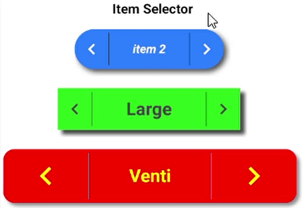

# Item Selector View

### A customizable item selector
 
## Features!

 •	 Set textSize, textStyle, textColor, textFont, vertical and horizontal padding
 
 •	 Set backgroundColor, cornerRadius
 
 •	 Set drawableSize, drawableHorizontalPadding, drawableTint, dividerColor
 
 •	 Set items array in XML file
 
 •   Set animation duration
 
 •   Button click listeners are built-in so you don't have to worry about anything
 

## Screen recording
 
 
 
 
# Install
 
```groovy
allprojects {
	repositories {
		...
		maven { url 'https://jitpack.io' }
	}
}
```
## Gradle

```groovy
dependencies {
	 implementation 'com.github.SMehranB:ItemSelectorCounter:1.0.0'
}
```

## Maven
```xml
<dependency>
	<groupId>com.github.SMehranB</groupId>
	<artifactId>ItemSelectorCounter</artifactId>
	<version>1.0.0</version>
</dependency>
 ```
# Use
 
## XML
```xml
<com.smb.itemselectorview.ItemSelector
    android:layout_width="wrap_content"
    android:layout_height="wrap_content"
    android:layout_marginTop="16dp"
    app:is_textStyle="italic|bold"
    app:is_drawableHorizontalPadding="8dp"
    app:is_verticalPadding="24dp"
    app:is_horizontalPadding="32dp"
    app:is_animationDuration="300"
    app:is_items="@array/sample_items"
    app:is_textColor="@color/white"
    app:is_buttonSize="30dp"
    app:is_drawableTint="@color/white"
    app:is_cornerRadius="25dp"
    app:is_backgroundColor="#2B7FFF"/>
 ```

## Kotlin
```kotlin
val itemSelector = ItemSelector(this)
val params = LinearLayout.LayoutParams(ViewGroup.LayoutParams.MATCH_PARENT, ViewGroup.LayoutParams.WRAP_CONTENT)
params.setMargins(16, TypedValue.applyDimension(TypedValue.COMPLEX_UNIT_DIP, 16f, resources.displayMetrics).toInt(), 16 ,0)

itemSelector.apply {
    layoutParams = params
    setTextParams(24, Color.YELLOW, Typeface.BOLD)
    setBackgroundParams(Color.RED, 25)
    setDrawableParams(50, 32)
    setTextPadding(32, 32)
    items = arrayListOf("Short", "Tall", "Grande", "Venti")
    dividerColor = Color.GRAY
    animationDuration = 300L
    drawableTint = Color.YELLOW
}

viewHolder.addView(itemSelector)
```

## 📄 License
```text
MIT License

Copyright (c) 2021 Seyed Mehran Behbahani

Permission is hereby granted, free of charge, to any person obtaining a copy
of this software and associated documentation files (the "Software"), to deal
in the Software without restriction, including without limitation the rights
to use, copy, modify, merge, publish, distribute, sublicense, and/or sell
copies of the Software, and to permit persons to whom the Software is
furnished to do so, subject to the following conditions:

The above copyright notice and this permission notice shall be included in all
copies or substantial portions of the Software.

THE SOFTWARE IS PROVIDED "AS IS", WITHOUT WARRANTY OF ANY KIND, EXPRESS OR
IMPLIED, INCLUDING BUT NOT LIMITED TO THE WARRANTIES OF MERCHANTABILITY,
FITNESS FOR A PARTICULAR PURPOSE AND NONINFRINGEMENT. IN NO EVENT SHALL THE
AUTHORS OR COPYRIGHT HOLDERS BE LIABLE FOR ANY CLAIM, DAMAGES OR OTHER
LIABILITY, WHETHER IN AN ACTION OF CONTRACT, TORT OR OTHERWISE, ARISING FROM,
OUT OF OR IN CONNECTION WITH THE SOFTWARE OR THE USE OR OTHER DEALINGS IN THE
SOFTWARE.
```
